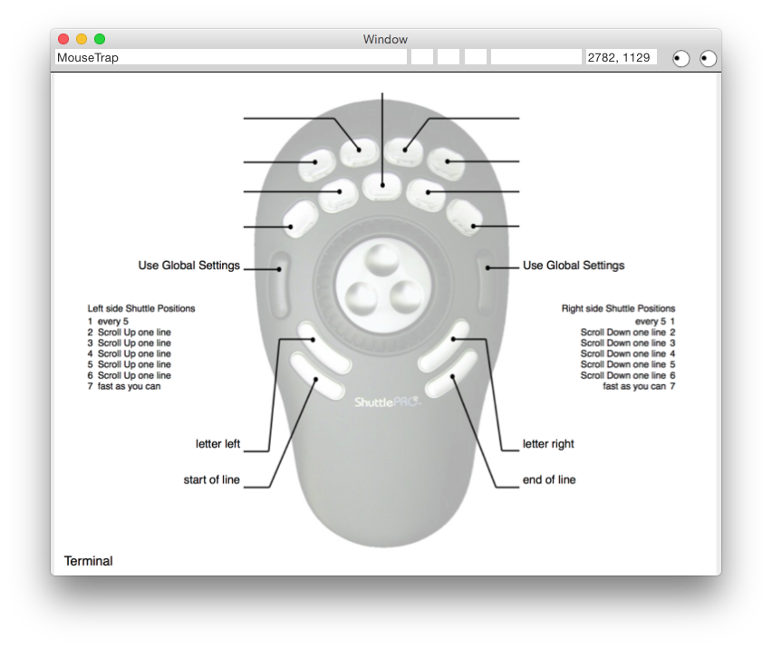
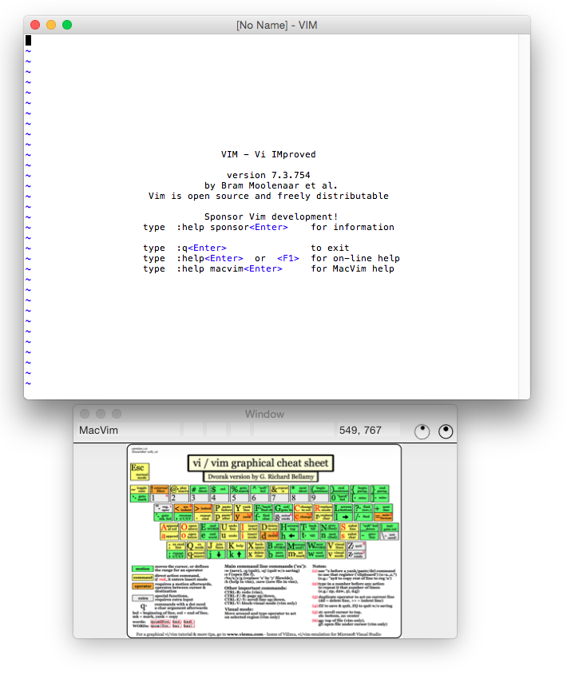
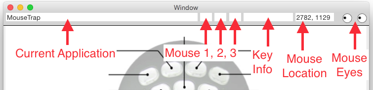

# Mouse Trap #
A strange application for the Macintosh that captures mouse and key press details and displays a user supplied image for the current running application.

## Why ##
Mouse Trap was designed to solve a very narrow set of issues which are represented below as user stories:

1. As a user of a [ShuttlePRO](http://ergo.contour-design.com/ergonomic-mouse/shuttlepro-v2) who can not remember what the buttons do, I need a visual reminder on screen as to current functionality.
2. As an iMac user with two external monitors, a visual queue is needed to help locate the current mouse position.

Keyboard short cuts use to fit on a small card you placed over your F keys but these days the short cuts are as numerous as the features. To assist with this you could buy a ShuttlePRO but then your stuck trying to remember what you set all the buttons to. The ShuttlePRO software does includes an export action which allows for the application specific configurations to be saved as a PDF view which you could pin up on your cube wall, but it's not ideal. Why not have these "cheat sheets" displayed for you by the fancy computer your using?These PDF views can then be converted to an image file. Since the software can write out it's own guides, I thought it would be nice to display them image related to the current front application.

## Usage ##
 
Open MouseTrap and position off to a side monitor if you have one. Size the window to about the size of the images you want to display.  Next, open `/Users/<username>/Library/Application Support/MouseTrap/images/` and place PNG or PDF files inside naming them after the application they are for:

* <application_name>.png 
* <application_name>.pdf

It takes a second or so for MouseTrap to recognize when you have switch applications, but when you have you will see your app image displayed.

The top row of the app displays mouse and keypress information.

1. Current Application (same as in the menu bar)
- Mouse button 1, 2, 3 codes
- Key press codes (currently only when MouseTrap is front app)
- Eyes - eyes are always looking at the mouse so you know where to look 

# External Links #
* [https://github.com/jceaser/MouseTrap](https://github.com/jceaser/MouseTrap)
* [http://thomascherry.name/w/Mouse_Trap](http://thomascherry.name/wiki/Mouse_Trap)
* [http://ergo.contour-design.com/ergonomic-mouse/shuttlepro-v2](http://ergo.contour-design.com/ergonomic-mouse/shuttlepro-v2)